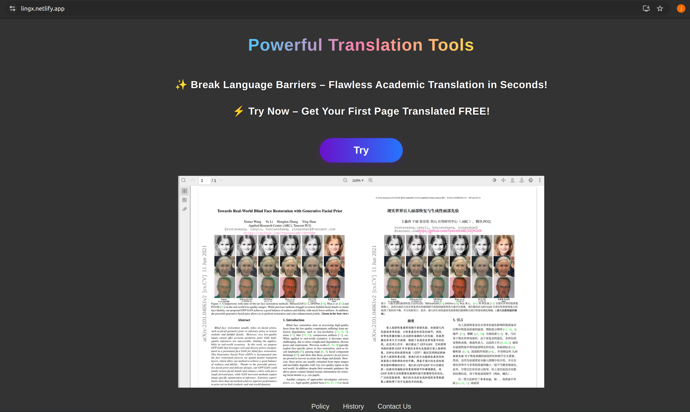
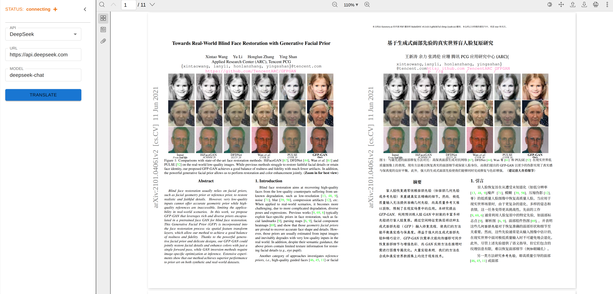

# paper_translator
地址 url: https://lingx.netlify.app/pdf_translator

### 低成本网站
最近看到了一个pdf翻译的项目，感觉想法非常好， 翻译后排版的效果也很惊艳， 想根据这个项目写点啥， 那就写个前端吧， 一来是继续练习一下react项目， 二来自己也想搭建一个低成本的网页。
对比一个月前的前端，整体好看了不少，与其说是熟练了react，更多的还是熟练了怎么让让大模型干活吧。网站的搭建简单记录一下。
#### 前端： react + js， 免费
#### 前端托管： netlify，react build 目录可以直接拖拽到网页上部署， 托管免费
#### 后端服务一（websocket 服务器）： 阿里云购买2C2G的云服务器，一年99
#### 后端服务二（翻译任务）：再服务器上跑翻译任务，2G内存不够用，尴尬了，于是把翻译任务放到自己本地电脑上，本地电脑作为一个websocket client和 服务器相连，拉取任务，当然也可以http，主要是感觉websocket api简洁一些。 

以下不是必须的
#### ssl证书： 阿里云免费证书
#### 域名：  阿里云18块购买了一个， 后面看看在新域名上部署一个博客，但可能要备案。

### :art: 主页   
      
  

